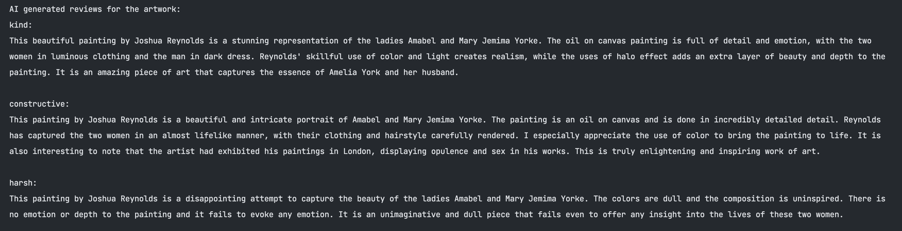

# Art Critiq

Art Critiq is a Python project that can generate three kinds of reviews given the image of an artwork and its details
like the artist, title, and type of artwork as well as the technique used in creating the artwork.

The project uses an image captioning model (multiple models are available to choose
from: [blip2](https://arxiv.org/abs/2301.12597), [git](https://arxiv.org/abs/2205.14100), [coca](https://arxiv.org/abs/2103.00020))
to generate a caption from the input image file and then uses the generated caption along with
the other details of the artwork to generate reviews using a [T5-Flan model](https://arxiv.org/abs/2210.11416).
The pipeline can be accessed through an API endpoint /generate_review (Created with FastAPI). The project is easily
dockerized with help of the
given Dockerfile and can be deployed anywhere as needed.

## Getting Started

### Requirements

- Docker
- Python >= 3.9

### Installation

#### Using Dockerfile:

- Navigate into the root project directory: ``cd art-critiq``
- Build the Docker image: ``docker build -t art-critiq .``
- Run the Docker image: ``docker run --name art-critiq -p 8080:8080 art-critiq-app``

This will start the API and map port 8000 on your local machine to port 8080 inside the container.

#### Using API Directly:

- Navigate into the root project directory: ``cd art-critiq``
- Install all libraries and modules mentioned in ``requirements.txt``: `pip install -r requirements.txt`
- Run the API: ``python app.py``

### Things to Remember:

- It is recommended to run the project in a CUDA enabled NVIDIA GPU system for better performance in terms of speed.
- In order to change the image captioning model that will be used, change it in `app.py` file. Specify the model to use
  while creating the ArtCritiq object with the `caption_model` parameter.

### API Endpoint

The API endpoint /generate_review expects a POST request with the following parameters:

- **url**: Valid and publicly accessible url for the artwork.
- **artist**: Name of the artist.
- **title**: Title of the artwork.
- **type**: Type of artwork (eg. Painting, Sculpture, etc.).
- **technique**: Technique used in the artwork (eg. Oil on Canvas, Watercolor, etc.)
- **review_type**: Type of review that is to be generated. Can be 'kind', 'constructive' or 'harsh'. If not
  specified, it will generate reviews for all the types.

Here's an example of how to use the API endpoint:

```python 
import requests

res = requests.post("http://0.0.0.0:8080/generate_review",
                    json={
                        "url": "https://openaccess-cdn.clevelandart.org/1942.645/1942.645_web.jpg",
                        "artist": "Joshua Reynolds (British, 1723–1792)",
                        "title": "Portrait of the Ladies Amabel and Mary Jemima Yorke",
                        "type": "Painting",
                        "technique": "Oil on canvas",
                    })
print(res.json())
```

### Results:



The API will return a JSON object with either the review as specified in `review_type` input parameter or all the three
reviews if `review_type` parameter is not specified. It is generated using the caption from the image captioning model
and the
artwork details using the T5-Flan model.

